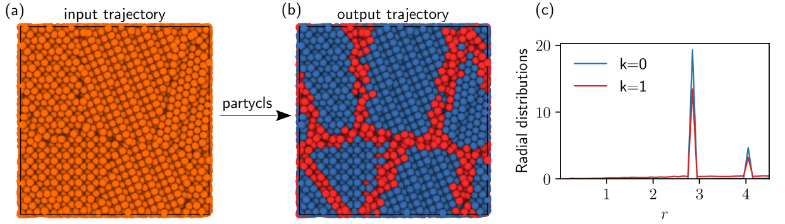

# Presentation

**partycls** is a Python framework for cluster analysis of systems of interacting particles. By grouping particles that share similar structural or dynamical properties, partycls enables rapid and unsupervised exploration of the system’s relevant features. It provides descriptors suitable for applications in condensed matter physics and integrates the necessary tools of unsupervised learning, such as dimensionality reduction, into a streamlined workflow. Through a simple and expressive interface, partycls allows one to open a trajectory file, perform a clustering based on the selected structural descriptor, and analyze and save the results with only a few lines of code.

----------

# Related publication

A [short paper](https://joss.theoj.org/papers/10.21105/joss.03723) presenting the code, written in collaboration with [Daniele Coslovich](https://www2.units.it/daniele.coslovich/), was published in *The Journal of Open Source Software*.

----------

# Short example

As a simple example, we consider the detection of the grain boundaries in a polycrystal formed by differently oriented FCC crystallites. This is easily achieved even with a simple radial descriptor, since the average radial distribution of particles at the boundaries is different than the one of the crystal in the bulk. The following short piece of code opens the input trajectory stored in the file `grains.xyz`, computes the local radial distribution functions of the particles, applies a standard [Z-Score](https://en.wikipedia.org/wiki/Standard_score) normalization on the data, and finally performs a clustering using the [Gaussian mixture model](https://towardsdatascience.com/gaussian-mixture-models-explained-6986aaf5a95) (GMM) with $K = 2$ clusters (default):

```python
from partycls import Workflow

wf = Workflow('grains.xyz',
	      descriptor='gr',
	      scaling='zscore',
	      clustering='gmm')
wf.run()
```

Each of these steps is easily tunable, so as to change the workflow with little effort. The labels are available as a simple attribute of the `Workflow` instance. Optionally, a set of output files can be produced for further analysis, including a trajectory file with the cluster labels. Quick visualization of the clusters, as in the following figure, is possible within partycls through optional visualization backends.



* **(a)** A polycrystalline material with differently oriented FCC crystallites.
* **(b)** Using the individual radial distributions of the particles as structural descriptor, the algorithm identifies the crystalline domains (blue, $k = 0$) and the grain boundaries (red, $k = 1$).
* **(c)** The radial distribution functions restricted to these two clusters display a marked difference, with higher peaks for the crystals. The 3D visualization was performed with [OVITO](https://www.ovito.org/).