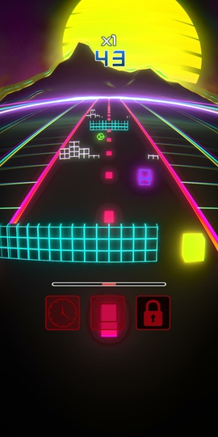

**Synth Road** is an arcade mobile game with synthwave vibes created using the [Unity](https://unity.com/) game engine. The goal is to go as far as possible on the road by avoiding the obstacles, and by using powers to help you do so. You can then publish your highscores on the leaderboard to compare your results with other players. The game is free to download on [Google Play](https://play.google.com/store/apps/details?id=com.JorisParet.SynthRoad), and it contains a single **optional** advertisement whose generated money (if any) will be given to humanitarian NGOs.

This game is the logical consequence of two things:
1. My obsession for the indie game [Outer Wilds](https://www.mobiusdigitalgames.com/outer-wilds.html), created by the geniuses at [Mobius Digital Games](https://www.mobiusdigitalgames.com/), which was also created with Unity.
2. The amazing YouTube channel of [Sebastian Lague](https://www.youtube.com/c/SebastianLague), where he creates various Unity projects and explains them in the most pedagogical, poetic and relaxing way.

These two things motivated me to experiment with Unity, and after a few weeks I wanted to prove to myself that I could create an entire project on my own from scratch. The most common mistake among amateur game developers is to directly start with unreasonably big projects, so I tried to keep it simple and came up with this mobile game. This was an opportunity to have a first look at various aspects of game design (gameplay, VFX, SFX, UI, etc.) and to learn more about the countless features of Unity. The game mechanics and visuals are simple, but for a first try I am pretty satisfied with the result, and I hope that I will have more time in the future for more elaborate projects.

The code and all the game assets are available on the [GitHub page](https://github.com/jorisparet/synth-road) of the project.