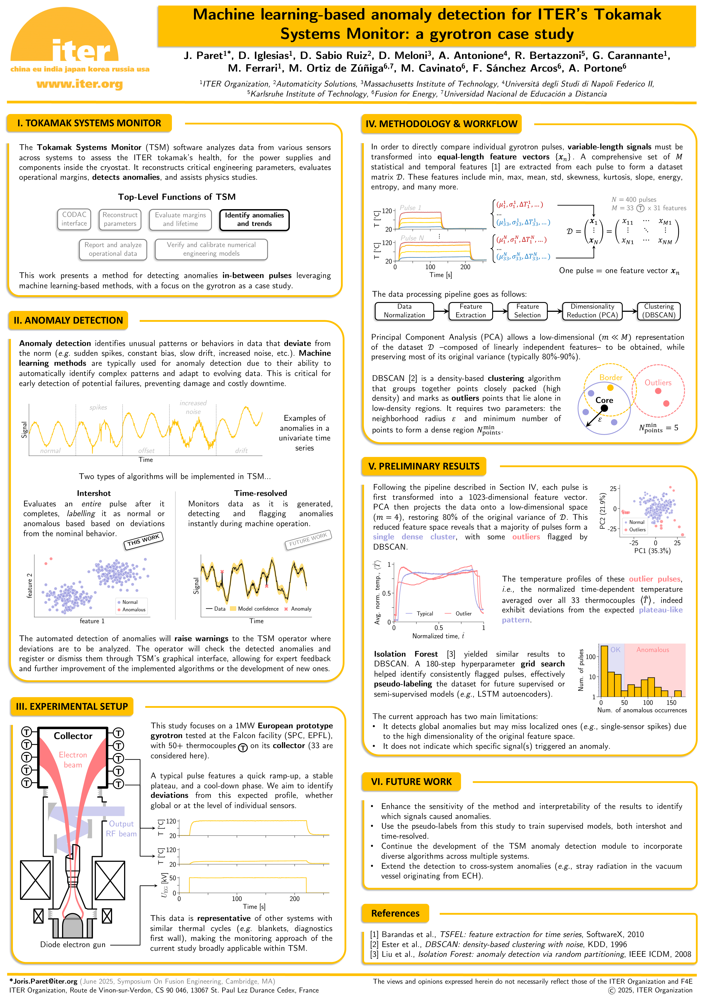

# SOFE 2025 – Machine learning-based anomaly detection for ITER's Tokamak Systems Monitor: a gyrotron case study

From June 23 to 26, 2025, I attended the **31st IEEE Symposium on Fusion Engineering (SOFE 2025)**, hosted by the [Plasma Science and Fusion Center](https://www.psfc.mit.edu/) (PSFC) at MIT in Boston, USA. This major event gathered 700 participants and featured a wide array of talks and posters covering all aspects of fusion engineering. There was also a strong presence of private fusion companies, including [Commonwealth Fusion Systems](https://cfs.energy/), [Proxima Fusion](https://www.proximafusion.com/), and many more, reflecting the growing industrial momentum around fusion energy.

I presented a poster titled **"Machine learning-based anomaly detection for ITER's Tokamak Systems Monitor: a gyrotron case study"**. The work focuses on applying unsupervised learning techniques to detect anomalies in gyrotron pulses, using data from the European industrial prototype for ITER. The proposed pipeline extracts statistical features from each pulse, reduces dimensionality via PCA, and applies DBSCAN clustering to identify outliers in an entirely data-driven way. It enables the detection of subtle irregularities without requiring labeled examples or predefined failure modes.

This method is designed to integrate with ITER's **Tokamak Systems Monitor (TSM)** software, which will support operators by providing early warnings and health assessments across multiple subsystems. While demonstrated on intershot gyrotron data, the approach is generalizable and can be adapted to other systems and subsystems covered by the TSM.

A conference proceedings paper associated with this contribution will be published in [IEEE Transactions on Plasma Science](https://ieeexplore.ieee.org/xpl/RecentIssue.jsp?punumber=27).

See the poster below or download it as a PDF [here](/uploads/SOFE_2025_poster.pdf).

