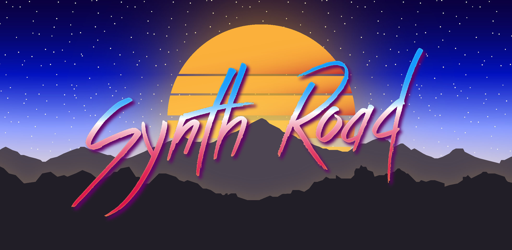
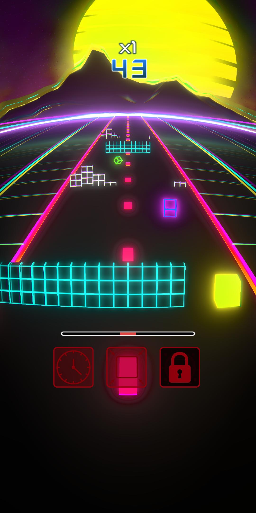

*Synth Road* is an arcade mobile game of obstacle course for Android with [synthwave](https://en.wikipedia.org/wiki/Synthwave) vibes. Money generated from the **optional** advertisement is donated to NGOs.

## Game rules

----------

1. Hold your finger down at the bottom of the screen and move it to slide the player left and right to avoid the obstacles.
2. Collect as many blue bonuses as possible to increase the score multiplier.
3. Collect gold bonuses to temporarily become invincible: bash through obstacles and collect as many blue bonuses as possible.
4. Use the power buttons to temporarily slow time, shrink the player or disintegrate obstacles.
5. Publish your highscores on the leaderboard to compare your results with other players.

## About

----------

Synth Road is made with [Unity](https://unity.com/). Illustrations, music and sound effects are original creations.

## Author

----------

[Joris Paret](https://jorisparet.github.io)
